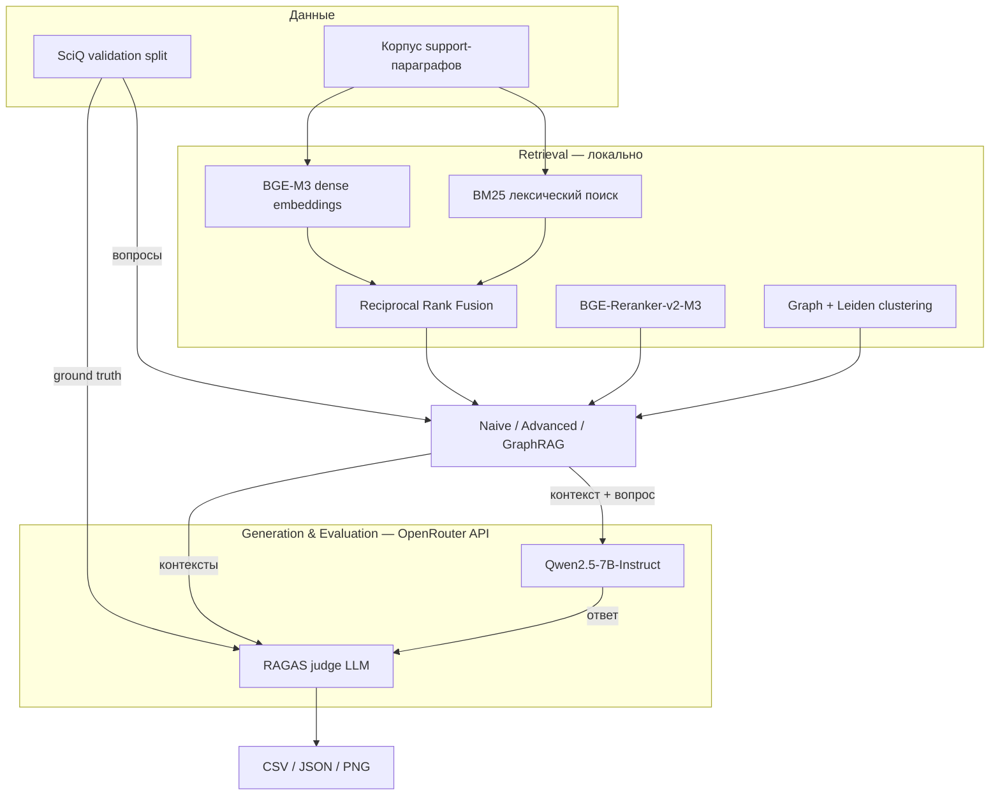

# SciQ RAG Benchmark

Сравнительная оценка трёх RAG-архитектур на научном корпусе **SciQ** с метриками **RAGAS** (Faithfulness, Context Precision, Context Recall).

Генерация ответов и оценка RAGAS выполняются через **OpenRouter API**; retrieval (BM25, dense embeddings, reranker) — локально.

---

## Содержание

- [Назначение](#назначение)
- [Архитектура эксперимента](#архитектура-эксперимента)
- [Три RAG-пайплайна](#три-rag-пайплайна)
- [Метрики RAGAS](#метрики-ragas)
- [Быстрый старт](#быстрый-старт)
- [Конфигурация](#конфигурация)
- [Результаты](#результаты)
- [Структура проекта](#структура-проекта)
- [Ссылки](#ссылки)

---

## Назначение

Проект воспроизводит сравнительный эксперимент из раздела 5.2 статьи о RAG-системах:

1. На одном корпусе (SciQ: физика, химия, науки о Земле) прогоняются **три архитектуры** retrieval + generation.
2. Каждый пайплайн отвечает на одни и те же вопросы.
3. Качество измеряется **автоматически** фреймворком RAGAS — без ручной экспертной разметки.

Традиционные метрики (BLEU, ROUGE) здесь не используются: они измеряют лексическое совпадение, а не **фактологическую достоверность** ответа.

---

## Архитектура эксперимента



**Принцип разделения:**

| Компонент | Где выполняется | Почему |
|-----------|-----------------|--------|
| BM25, BGE-M3, reranker | Локально (CPU/GPU) | Быстро, бесплатно, детерминированно |
| Генерация ответов | OpenRouter API | Не нужна локальная GPU с 7B+ моделью |
| RAGAS (faithfulness и др.) | OpenRouter API | Много LLM-вызовов; API стабильнее локального inference |

---

## Три RAG-пайплайна

### 1. Naive RAG

Классическая схема «retrieve → generate»:

1. **BM25** — лексический поиск по токенам (TF-IDF-подобный scoring).
2. **BGE-M3** — dense retrieval по косинусному сходству эмбеддингов.
3. **Reciprocal Rank Fusion (RRF)** — объединение двух ранжирований:
   ```
   score(d) = Σ 1 / (k + rank_i(d)),  k = 60
   ```
4. Top-k чанков передаются в LLM для генерации ответа.

### 2. Advanced RAG

Добавляет query expansion и переранжирование:

1. **HyDE** (Hypothetical Document Embeddings) — LLM генерирует гипотетический научный абзац, который *мог бы* содержать ответ на вопрос.
2. Эмбеддинг HyDE-документа усредняется с эмбеддингом исходного запроса.
3. Dense + BM25 отбор кандидатов из пула (~30 документов).
4. **Cross-Encoder reranking** (BGE-Reranker-v2-M3) — попарная оценка `(вопрос, документ)`; точнее bi-encoder, но медленнее.
5. Top-k после rerank → LLM.

### 3. GraphRAG

Структурированный retrieval через граф знаний:

1. Из каждого документа извлекаются **сущности** (научные термины, числа с единицами измерения).
2. Строится **граф совместной встречаемости** сущностей в документах.
3. **Кластеризация Leiden** группирует связанные документы в тематические сообщества.
4. Для запроса находится кластер с максимальным пересечением сущностей с вопросом.
5. Dense search внутри кластера → top-k → LLM.

---

## Метрики RAGAS

RAGAS (Es et al., 2023) оценивает RAG **без эталонных human annotations** для каждого утверждения — judge-модель через API проверяет согласованность.

| Метрика | Что измеряет | Формула (упрощённо) |
|---------|--------------|---------------------|
| **Faithfulness** | Ответ опирается на контекст, а не галлюцинирует | F = \|A ∩ C\| / \|A\|, где A — claims в ответе, C — факты в контексте |
| **Context Precision** | Релевантные чанки выше в top-k | Weighted Average Precision по релевантным документам |
| **Context Recall** | Контекст покрывает ground truth | Доля информации из эталонного ответа, присутствующая в retrieved context |

Все три метрики ∈ [0, 1]; выше — лучше.

---

## Быстрый старт

### Требования

- Python 3.10–3.13
- ~2 GB диска для моделей retrieval (BGE-M3, reranker)
- Аккаунт [OpenRouter](https://openrouter.ai) и API-ключ

### Установка

```powershell
git clone <repo-url>
cd rag_eval

python -m venv .venv
.\.venv\Scripts\Activate.ps1        # Windows
# source .venv/bin/activate         # Linux/macOS

pip install -r requirements.txt
python scripts/download_models.py   # BGE-M3 + reranker (~1.5 GB)
```

### API-ключ OpenRouter

```powershell
copy .env.example .env
notepad .env
```

Файл `.env` в корне проекта:

```env
OPENROUTER_API_KEY=sk-or-v1-ваш-ключ
```

Ключ создаётся на [openrouter.ai/keys](https://openrouter.ai/keys). Файл `.env` в git не попадает (см. `.gitignore`).

### Проверка без API

```powershell
python scripts/smoke_test.py
```

### Запуск эксперимента

```powershell
python run_experiment.py
```

По умолчанию: 50 вопросов SciQ × 3 пайплайна. Время: ~15–25 мин (зависит от скорости API).

---

## Конфигурация

Файл `config.yaml`:

```yaml
openrouter:
  model: qwen/qwen-2.5-7b-instruct      # генерация ответов
  judge_model: qwen/qwen-2.5-7b-instruct # RAGAS judge
  max_tokens: 256
  temperature: 0.1

dataset:
  max_samples: 50    # 1000 = полный validation split

ragas:
  timeout: 120       # секунд на LLM-вызов RAGAS
  max_workers: 8     # параллельные запросы к API

pipelines:
  - naive
  - advanced
  - graph
```

Другие модели OpenRouter: [openrouter.ai/models](https://openrouter.ai/models)

---

## Результаты

После прогона в `results/`:

| Файл | Содержимое |
|------|------------|
| `ragas_summary_*.csv` | Сводная таблица метрик по пайплайнам |
| `ragas_metrics_*.json` | Метрики + метаданные эксперимента |
| `predictions_*_*.jsonl` | Вопросы, ответы, контексты, ground truth |
| `comparison_*.png` | Bar chart сравнения |

Пример `ragas_summary_*.csv`:

```
pipeline,faithfulness,context_precision,context_recall
naive,0.82,0.75,0.68
advanced,0.88,0.81,0.72
graph,0.85,0.78,0.70
```

---

## Структура проекта

```
rag_eval/
├── .env.example          # шаблон API-ключа
├── .gitignore
├── config.yaml           # параметры эксперимента
├── requirements.txt
├── run_experiment.py     # точка входа
├── scripts/
│   ├── download_models.py
│   └── smoke_test.py
└── src/
    ├── config.py
    ├── data/
    │   └── sciq_loader.py       # загрузка SciQ, построение корпуса
    ├── indexing/
    │   └── hybrid_retriever.py  # BM25 + BGE-M3 + RRF
    ├── llm/
    │   ├── client.py            # OpenRouter API client
    │   └── factory.py           # сборка LLM из config
    ├── rag/
    │   ├── base.py              # базовый RAG: retrieve → generate
    │   ├── naive_rag.py
    │   ├── advanced_rag.py      # HyDE + reranker
    │   └── graph_rag.py         # Leiden + entity graph
    └── evaluation/
        ├── ragas_eval.py        # RAGAS metrics
        └── run_benchmark.py     # оркестрация эксперимента
```

---

## Публикация в Git

```powershell
cd rag_eval
git init
git add .
git commit -m "Initial commit: SciQ RAG benchmark with RAGAS"
```

Убедитесь, что `.env` и `results/` не попали в коммит:

```powershell
git status   # .env не должен быть в staged files
```

---

## Ссылки

- [RAGAS: Retrieval Augmented Generation Assessment](https://aclanthology.org/2024.eacl-demo.16/) — Es et al., 2023
- [SciQ dataset](https://huggingface.co/datasets/allenai/sciq) — Allen AI
- [BGE-M3](https://huggingface.co/BAAI/bge-m3) — BAAI
- [OpenRouter](https://openrouter.ai/docs) — API документация
